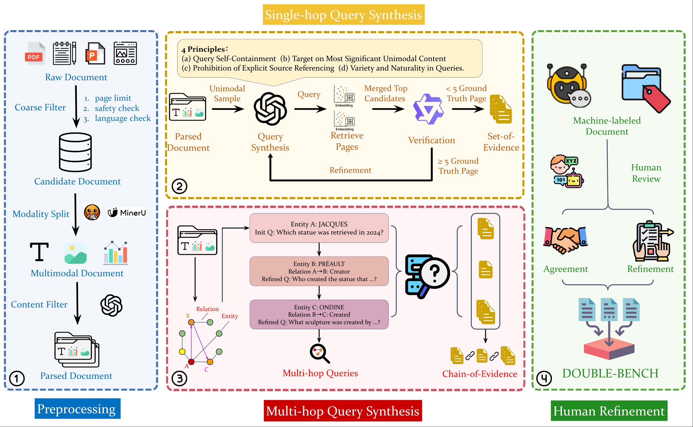

# Double-Bench

<div align="center">
📖<a href="http://arxiv.org/abs/2508.03644">Paper</a> | 🏠<a href="https://double-bench.github.io/">Homepage</a> | 🤗<a href="https://huggingface.co/datasets/Episoode/Double-Bench">Huggingface</a>
</div>

## 🚀Overview
​         Retrieval-Augmented Generation (RAG) systems using Multi-modal Large Language Models (MLLMs) show great promisefor complex document understanding, yet their development is critically hampered by inadequate evaluation. Current benchmarks often focus on specific part of document RAG system and use synthetic data with incomplete ground truth and evidence labels, therefore failing to reflect real-world bottlenecks and challenges. 

​	To overcome these limitations, we introduce Double-Bench: a new large-scale, multilingual, and multimodal evaluation system that is able to produce fine-grained assessment to each component within document RAG systems. It comprises 3,276 documents (72,880 pages) and 5,168 single- and multi-hop queries across 6 languages and 4 document types with streamlined dynamic update support for potential data contamination issues. Queries are grounded in exhaustively scanned evidence pages and verified by human experts to ensure maximum quality and completeness. We hope our fully open-source Double-Bench provide a rigorous foundation for future research in advanced document RAG systems. 




## 💡 Highlights

- 🔥   **Large-scale, Multimodal & Multilingual**: Introduces Double-Bench, a large-scale benchmark featuring 3,276 documents (72,880 pages) across 4 document types and 6 languages.

- 🔥   **High-Quality Queries & Annotations**: Features 5,168 high-quality single- and multi-hop queries generated through iterative, clarity-focused refinement and knowledge-graph-guided synthesis. All ground-truth evidence is exhaustively verified by human experts to ensure maximum precision and completeness.
- 🔥   **Comprehensive Evaluation & In-depth Insights**: Conducts extensive experiments on 9 state-of-the-art embedding models, 4 MLLMs, and 4 advanced document RAG frameworks. The findings uncover critical bottlenecks, such as the "overconfidence dilemma" , and provide a rigorous foundation for future research.

  


## 🔍Benchmark

We save our benchmark  in `./Double_Bench.`

- This is an example of a single-hop question in our Double-Bench benchmark. It includes 
  - **`uid`**: The unique identifier for the data point.
  - **`question`**: The specific text of the query.
  - **`answer`**: The reference answer .
  - **`reference_page`**: A list containing one or more evidence page numbers in the source document.
  - **`source_type`**: The type of modality from which the answer is derived.
  - **`language`**: The language of the query and the document.
  - **`doc_path`**: The storage path of the source document.
  - **`query_type`**: The classification or type of the query.
  - **`doc_type`**: The classification or type of the source document.

```
    {
        "uid": "0962",
        "question": "What does the historical population data suggest about demographic changes in Yorkton from 1901 to 2021?",
        "answer": "The historical population data indicates a significant increase in Yorkton's population from 700 in 1901 to 16,280 in 2021, reflecting substantial demographic growth over the 120-year span.",
        "reference_page": [3,4,12],
        "source_type": "table",
        "language": "en",
        "doc_path": "docs/English/0786",
        "query_type": "Specific Information Retrieval",
        "doc_type": "HTML Pages"
    }
```

- This is an example of a multi-hop question in our Double-Bench benchmark. It includes top-level information for the final query and a `steps` section that breaks down the reasoning process into individual sub-questions.
	- **`uid`**: The unique identifier for the data point.
	- **`question`**: The final, complex multi-hop query.
	- **`answer`**: The final reference answer to the multi-hop query.
	- **`reference_page`**: A comprehensive list of all evidence page numbers required across all reasoning steps.
	- **`language`**: The language of the query and the document.
	- **`doc_path`**: The storage path of the source document.
	- **`query_type`**: The classification or type of the query.
	- **`source_type`**: The type or list of modalities from which the answer is derived.
	- **`doc_type`**: The classification or type of the source document.
	- **`steps`**: A list of objects, where each object represents a single step in the reasoning chain.
    - **`question[n]`**: The intermediate question for step 'n'.
    - **`answer[n]`**: The intermediate answer for step 'n'.
    - **`reference_page`**: A list of evidence pages for that specific step.

```
    {
        "uid": "1110",
        "question": "What significantly reduces the incidence and severity of the condition that the drug evaluated in the pilot evaluation for treating hot flashes has been shown to reduce in phase II trials by 75% to 90% in clinical trials?",
        "answer": "Hormone therapy",
        "reference_page": [12,15,29,31,34,35,36,40,41,42],
        "language": "en",
        "doc_path": "docs/English/1527",
        "query_type": "Specific Information Retrieval",
        "source_type": ["text","table"],
        "steps": [
            {
                "question0": "What drug was evaluated in the pilot evaluation for treating hot flashes?",
                "answer0": "Gabapentin",
                "reference_page": [15,29]
            },
            {
                "question1": "What condition has Gabapentin been shown to reduce in phase II trials?",
                "answer1": "Hot flushes",
                "reference_page": [29,36,40,42]
            },
            {
                "question2": "What significantly reduces the incidence and severity of hot flushes by 75% to 90% in clinical trials?",
                "answer2": "Hormone therapy",
                "reference_page": [12,31,35,36,41]
            }
        ],
        "doc_type": "PDF"
    }
```

